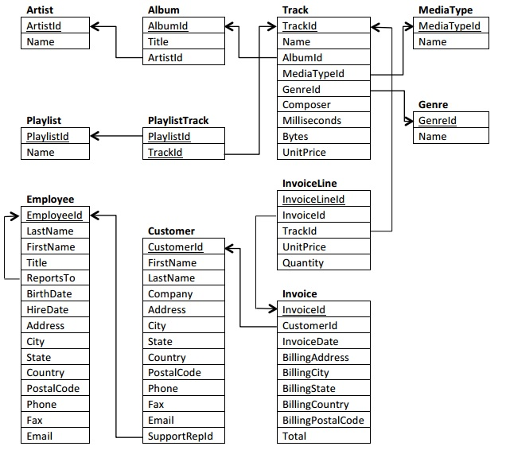

# Analysis with SQL

## General description

This repository contains examples of SQL commands for work different concepts about data analysis and explore diverse kind of queries. 

## Database schema

Here is the schema of the database used in all the queries.

## Directory structure 

- Directory *chinook* has all the files related with the database. 
  - A SQL schema for load and create the chinook database structure into SQLIte
  - The database used ready for load into SQLite

- Directory *queries* has all the queries tested in the chinook database. 
  -  *SQL_1_basics.sql*: File contains basic queries about FROM, SELECT.
  -  *SQL_2_operations.sql*: File contains quieries about logic operators and filtering clauses.  
  - *SQL_3_string_date.sql*: Queries are about date type or strings.
  - *SQL_4_A_subqueries.sql*:  Queries oriented to work with subqueries in the body of the SELECT.
  - *SQL_4_B_joins*: Queries that test different kind of joins (LEFT, RIGHT, etc.).
  - *SQL_4_C_advanced*: Queries more complex to integrate different concepts about SQL commands.

